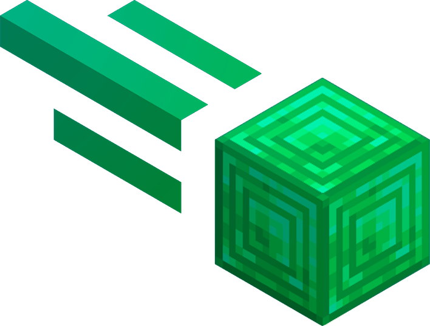

	
	<h1>Meteor Plus</h1>
	 
		An addon for <a href="https://github.com/MeteorDevelopment/meteor-client">Meteor client</a> that adds many blatant features.
	 
	 
	
    
	
	
	 
	
	
	
	 
	
	 
	
	
	 
	 
	
Thanks some russian paid clients and <a href="https://github.com/CCBlueX/LiquidBounce">LiquidBouce</a> 🤫

## Modules
| Module | Description | Bypasses |
|--|--|--|
| **Fly Plus** | **Flight for Anti-Cheats** | **Matrix** |
| **Speed Plus** | **Speed for Anti-Cheats** |  **Matrix, ACC, Vulcan, NCP**  |
| **Spider Plus** | **Spiderfor Anti-Cheats** | **Matrix, Vulcan** |
| **Jesus Plus** | **Jesus for Anti-Cheats** | **Matrix, Vulcan** |
| **Fast Ladder Plus** | **Fast Ladder for Anti-Cheats** | **Spartan** |
| **Safe mine** | **Prevents player from lava** | **Matrix** |
| **X-Ray bruteforce** | **Xray protection bypass for servers 1.12.2** | **Ore Obfuscator** |
| **KillAura Plus** | **Shield Breaker KillAura** | |
| **Anti Bot** | **Ignores bots for KillAura Plus** | |

## Commands
| Command | Description | Bypasses |
|--|--|--|
| **eclip** | **Vertical clip** | **Matrix** |

# Installation Guide
1. Install [minecraft](https://www.minecraft.net) 1.19.4 or 1.20
2. Install [fabric](https://fabricmc.net) and [fabric api](https://www.curseforge.com/minecraft/mc-mods/fabric-api) for your version of minecraft
3. Download [meteor client](https://meteorclient.com) for your version of minecraft
4. Download [meteor plus](https://github.com/Nekiplay/MeteorPlus/releases) for your version of minecraft
5. Place the meteor client and meteor plus in your mods folder
